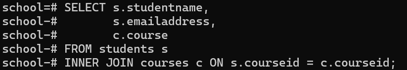
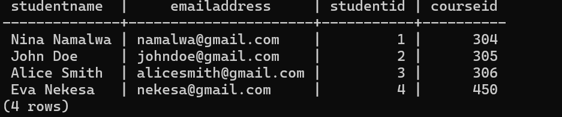

# PostgreSQL DOCUMENT
## PostgreSQL Joins
### Inner Join
 An INNER JOIN is used in SQL to select records that have matching values in both tables involved in the join. When performing an INNER JOIN, only the rows where there is a match in both tables are returned. This is useful for retrieving data that has related information across multiple tables.

 #### Examples:
 Suppose you have two tables: students and courses. You want to retrieve the student name and courses details for each student:

  **students table**

  

  **courses table**

 

 To get the student name along with course details, you can use:

 

 **Explanation of the Query**
 
 **SELECT Statement:** This selects the studentname and emailaddress from the students table (s) and the course from the courses table (c).
**FROM Clause:** It specifies that you are working with the students table (aliased as s).
**INNER JOIN Clause:** This joins the courses table (aliased as c) on the condition that s.courseid matches c.courseid. This means only the records where there is a corresponding courseid in both tables will be included in the result set.

 **Final result:**

 

### Left Join
The LEFT JOIN keyword selects ALL records from the "left" table, and the matching records from the "right" table. The result is 0 records from the right side if there is no match.

**students**

**courses**

Now, we want to join these two tables so that we can see all students and their corresponding courses, if available. We'll use a left join to do this:

**Final result**

### Right join

The RIGHT JOIN keyword selects ALL records from the "right" table, and the matching records from the "left" table. The result is 0 records from the left side if there is no match.

**students**

**courses**

 **Final result**

The RIGHT JOIN returns all records from the courses table.
Since there are no courses corresponding to courseid 450 in the courses table, the studentname, emailaddress, and studentid fields return NULL for that row.

### Full Join

The FULL JOIN keyword selects ALL records from both tables, even if there is not a match. For rows with a match the values from both tables are available, if there is not a match the empty fields will get the value NULL.

**students**

**courses**

**Full join Query**

**Final result**

### ACID properties
#### PostgreSQL transaction
*What is a database transaction?*

A database transaction is a single unit of work that consists of one or more operations.

**Example**

A bank transfer from one account to another. A complete transaction must ensure a balance between the sender and receiver accounts.
 This implies that if the sender account transfers X amount, the receiver receives exactly X amount, neither more nor less.

A PostgreSQL transaction is atomic, consistent, isolated, and durable. These properties are often referred to collectively as ACID:

**Atomicity** guarantees that the transaction is completed in an all-or-nothing manner.

**Consistency** ensures that changes to data written to the database are valid and adhere to predefined rules.

**Isolation** determines how the integrity of a transaction is visible to other transactions.

**Durability** ensures that transactions that have been committed are permanently stored in the database.

Sample table

1. **Atomicity**

Atomicity ensures that all parts of a transaction are completed or none are. If you perform a transaction that involves updating multiple accounts, it will either fully succeed or fully fail.

2. **Consistency**

Consistency guarantees that transactions bring the database from one valid state to another, maintaining all rules (like the positive_balance constraint).

If this transaction results in a negative balance, it will fail and the COMMIT will not go through, ensuring data integrity.

3. **Isolation**

Isolation ensures that concurrent transactions don’t interfere. For example, if two users attempt to read and update Nina's balance simultaneously, one of them will need to wait until the other completes.

**Example: Transaction A:**

 **Transaction B:**

**Result of Isolation**

**Transaction A:** After committing, Nina Namalwa's balance is updated from $500 to $200.

**Transaction B:**

 Even if it starts before Transaction A commits, it sees Nina's balance as $500 at the time of the SELECT, not affected by Transaction A’s withdrawal until it commits.
After both transactions are complete:

Nina Namalwa: $200

Eva Nekesa: $3000

4.**Durability**

Durability ensures that once a transaction is committed, the data is permanently saved to the database, even if there’s a crash right afterward.

Once committed, the change to Eva's balance is durable. Even if the database server crashes immediately afterward, Eva’s new balance will be preserved.

Each of these properties works to ensure that your data remains reliable, accurate, and resilient under various conditions.

### NORMALIZATION
#### First Normal Form(1NF)

First Normal Form (1NF) in database normalization ensures that a table's structure is organized so that each column contains only atomic (indivisible) values, and each column contains values of a single type. In other words, 1NF eliminates repeating groups and ensures each field contains only one value.

**First Normal Form Rules**

1. Using row order to convey information is not permitted.
2. Mixing data types within the same column is not permitted.
3. Having a table without a primary key is not permitted.
4. Repeating groups are not permitted.

**sample table**

Each row has atomic values, with no repeating or grouped data within any column.
The composite primary key (student_id, course, phone_number) ensures that each row is unique and adheres to 1NF.

This setup allows for simple querying, updating, and deleting of data, while preventing duplication within the table. If you need help with further normalization or queries, let me know!
 

 #### Second Normal Form(2NF)

 The initial table structure contains the following columns:

 

 **Primary Key:** {student_id, course} (composite key)

**Non-key Attributes:** student_name, phone_number

The table is already in 1NF, as each column contains only atomic (indivisible) values, and there are no repeating groups.

Partial dependencies occur when a non-key attribute depends on only a part of the primary key. In this case:

student_name and phone_number depend only on student_id.

These attributes do not depend on the entire composite key {student_id, course}, leading to partial dependencies

**Students Table:** This table includes details unique to each student, with student_id as the primary key:

**Student_Courses Table:** This table captures the relationship between students and courses, using {student_id, course} as the composite primary key:

**Result**

After restructuring, the tables are now in 2NF:

**Students Table:** Contains only data fully dependent on student_id.
Student_Courses Table: Represents the many-to-many relationship between students and courses, with no partial dependencies.

### Third Normal Form(3NF)

To achieve Third Normal Form (3NF), we need to ensure that all non-key attributes are not only fully dependent on the primary key (2NF) but also that there are no transitive dependencies meaning no non-key attribute depends on another non-key attribute.

**Primary Key:** student_id

**Non-Key Attributes:** student_name, phone_number

**Analysis for 3NF**

In this table:

**student_name** and phone_number are directly dependent on **student_id.**
There are no transitive dependencies, as neither student_name nor phone_number depends on any other non-key attribute.

**Result:** The students table is in 3NF since all non-key attributes are dependent on the primary key, and there are no transitive dependencies.

### Boyce Codd Normal Form

To achieve Boyce-Codd Normal Form (BCNF), a database must first satisfy the requirements of Third Normal Form (3NF), and then ensure that every determinant in the table is a candidate key. A determinant is an attribute (or a set of attributes) on which some other attribute is fully functionally dependent.

**Example**

 
 This table now holds unique combinations of student_id and student_name, allowing you to have multiple names for the same student ID without causing ambiguity.

 By restructuring the original Students Table, we eliminate partial dependencies, ensuring that all determinants in the tables are candidate keys.

 ### Fourth Normal Form

**students table**

**phone numbers table**

**courses table**

**Summary**

Now we have the following:

**Students Table:** Maintains unique combinations of student_id and student_name.

**Phone_Numbers Table:** Allows multiple phone numbers for each student, with foreign key references.

**Courses Table:** Allows multiple courses for each student, also maintaining foreign key references.

With this structure, each table has no multi-valued dependencies, satisfying the requirements for Fourth Normal Form (4NF). This design ensures data integrity and prevents redundancy, providing a clear and organized database structure.

